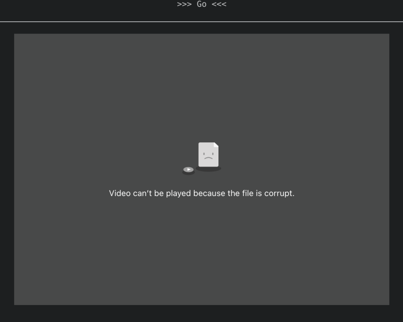

## The Problem

When I first launched the VisualSort program demo, everything worked perfectly fine during my testing. Until a friend mentioned that the output videos did not play on the Firefox browser. Videos also did not work on mobile device browsers. Attempts to run the program in Firefox resulted in the image below.



At first, I suspected the culprit to be Vercel, my cloud platform. Perhaps they were doing some caching or asset optimization which caused the error somehow in Firefox. However, after looking through Vercel's settings and documentation, and the fact that the program worked perfectly well on Chrome and chromium based browsers but not mobile and Firefox, this was not the case.

I went into inspect page on Firefox to find any error codes and was greeted with this:

`Error Code: NS_ERROR_DOM_MEDIA_FATAL_ERR (0x806e0005)`

<details>
<summary>Expand for full error message</summary>

```
Media resource ... could not be decoded, error: Error Code: NS_ERROR_DOM_MEDIA_FATAL_ERR (0x806e0005)
Details: auto mozilla::SupportChecker::AddMediaFormatChecker(const TrackInfo &)::(anonymous class)::operator()() const: Decoder may not have the capability to handle the requested video format with YUV444 chroma subsampling.
```

</details>

An online search brought me to this [Bugzilla page](https://bugzilla.mozilla.org/show_bug.cgi?id=1368063). Seems as though YUV444 chroma subsampling is either a proprietary format or there are licensing issues and Firefox will not support it. This may also be why the video did not play on iOS. Unfortunately this the default option ffmepg uses to generate videos.

## The Fix?

A poster on the Bugzilla page suggested adding this line into the ffmepg command: `-pix_fmt yuv420p` to use YUV420 chroma subsampling which Firefox supports. I updated the code and redeployed the website to find that the same issue was present still.

## The Fix

After a lot of research online and digging into the video's codec information using _VLC Player_ and _ffprobe_, I discovered that while the chroma subsampling format was now correct, the video profile was still one that Firefox and mobile devices do not support. The H264 profile was: `High 4:4:4 Predictive@L4`. ffmpeg picked this profile because I used the `-crf 0` option in my ffmepg command to output lossless videos for the best quality.

To make the videos work on most devices, more compatible profiles to use are _Baseline Profile_, _Main Profile_, or _High Profile_. The _High 4:4:4 Predictive Profile_ seems to be too new or advanced for a lot of devices. See [here](https://blog.mediacoderhq.com/h264-profiles-and-levels/).

I decided to use the _High 4:2:2 Profile_ to get the best video quality while still maintaining compatibility with most modern devices. I added the option `-profile:v high422` to my ffmpeg command and removed `-crf 0`. This now worked on mobile phones and Firefox.

Try the program [**here**](/programs/visualsort)!

<details>
<summary>Expand for an example of the new ffmpeg command:</summary>

```shell
ffmpeg -loglevel quiet -y -r 60 -i frame00001.png -i sound.wav -c:v libx264 -preset veryslow -profile:v high422 -pix_fmt yuv420p -vf pad=ceil(iw/2)*2:ceil(ih/2)*2 -c:a aac -map 0:v -map 1:a output.mp4
```

</details>

<details>
<summary>Expand for the original ffmpeg command:</summary>

```shell
ffmpeg -loglevel quiet -y -r 60 -i frame00001.png -i sound.wav -c:v libx264 -preset veryslow -c:a aac -crf 0 -map 0:v -map 1:a output.mp4
```

</details>
